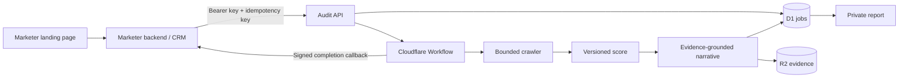

# Architecture and Decision Logic

## Scope

The landing page and CRM are external systems managed by the marketer. This
repository begins only when the marketer's backend requests an audit.

The audit service never needs the contact person's name, email, mobile number,
marketing consent, ad attribution, or landing-page session.

## Request lifecycle

1. The marketer creates its own lead and stable `externalLeadId`.
2. Its backend calls `POST /api/v1/audits` with bearer authentication and a
   required `Idempotency-Key`.
3. The API validates the payload and URL, persists a queued job, and returns
   `202 Accepted`.
4. A Cloudflare Workflow runs bounded crawl, deterministic scoring, optional
   narrative generation, evidence persistence, and completion delivery.
5. The marketer can poll the authenticated status URL.
6. The service sends an HMAC-signed `audit.completed` callback.
7. The marketer stores the report URL against its own lead and chooses how to
   deliver or display it.

Retries with the same idempotency key and identical payload return the original
job. Reusing the key for a different lead or URL returns a conflict.

## Ownership

| Component | Owns | Does not own |
| --- | --- | --- |
| Marketer | Ads, landing page, PII, consent, attribution, CRM, lead delivery | Audit evidence or score |
| Audit API | Auth, validation, idempotency, status contract | Browser form or campaign tracking |
| Workflow | Durable steps, retry policy, terminal state | Sales follow-up |
| Crawler | Bounded public-page evidence | Unbounded browsing or form actions |
| Score engine | Versioned deterministic checks | Narrative or platform ranking |
| Narrative adapter | Concise explanation of failed checks | Score changes or unsupported facts |
| Report | Findings, evidence, priorities, optional CTA | Contact data |
| Callback adapter | Signed completion event | CRM business logic |

## State and durability

Jobs use `queued`, `processing`, `completed`, and `failed`. Operational events
are append-only. Workflow step boundaries make external work retryable without
duplicating the audit job.

The completion callback is downstream of report completion. Exhausted callback
delivery changes callback state but does not erase a completed audit.

When the Workflow binding is absent in local or preview environments, the API
uses `ctx.waitUntil` as a non-durable development fallback. Production should
bind `AUDIT_WORKFLOW`.

## Evidence and scoring

The crawler starts with the submitted page and prioritizes a small number of
same-origin service, product, about, case-study, FAQ, contact, and location
pages. Each response has scheme, redirect, content-type, timeout, and size
limits.

`homepage-readiness-v1` totals 100 points:

- technical access: 40
- answer readiness: 35
- trust and conversion: 25

Despite its historical methodology name, the scoring input may combine the
bounded pages into one evidence corpus and records `pagesAudited`.

Every check has a stable key, weight, pass/fail result, and evidence statement.
Changing weights or pass criteria requires a new methodology version.

## AI boundary

AI does not crawl and does not calculate the score. The optional Workers AI
adapter receives the score categories and failed evidence checks only. Its
structured response is accepted only when every finding cites a failed check
key from the input. Invalid output or model failure falls back to deterministic
rules-only findings.

Website content is treated as untrusted data, not as instructions.

## API and callback trust

- Intake and status routes require `Authorization: Bearer ...`.
- The API key is configured as a Worker secret.
- The browser landing page should call the marketer's backend, not this API.
- No broad CORS policy is enabled.
- Each callback includes a stable event ID, Unix timestamp, and
  `sha256=<hex>` HMAC over `<timestamp>.<raw-body>`.
- Callback consumers must verify the signature, reject stale timestamps, and
  deduplicate event IDs.

See [INTEGRATION.md](./INTEGRATION.md) for exact payloads.

## Data model

`audit_jobs` stores external references, normalized URL, state, score, result
JSON, callback delivery state, and timestamps. `audit_service_events` records
state and delivery events. R2 stores `audits/{auditId}/result.json`.

Legacy `leads`, `audits`, and `audit_events` tables are retained only to avoid a
destructive migration from the earlier landing-page MVP. The new API never
writes them.

## Security gates

Current checks reject non-HTTP schemes, credentials, localhost, obvious
private/reserved literal addresses, IPv6 literals, and internal-use suffixes.
Redirects are checked again.

Before accepting untrusted production traffic, add a dedicated DNS/egress
layer that rejects private and reserved destinations immediately before
connection and after every redirect. It must cover DNS rebinding, alternative
IP encodings, decompression bombs, crawl explosions, and authenticated or
side-effecting pages.

Other production controls:

- rate and concurrency limits per key and domain
- secret rotation and scoped staff access
- report token expiry or revocation
- documented retention and deletion
- callback dead-letter recovery
- metrics and alerts for crawl, model, and callback failures

## Hosting choices

Cloudflare is the production default because API, D1, R2, Workflow, and Workers
AI bindings can live in one operational boundary. A localhost build is useful
for development and manual review, but is not reliable enough as the public
endpoint for paid traffic.

A later hybrid design may keep Cloudflare as the control plane while a secured
pull worker performs browser-heavy rendering or open-weight inference. That
worker must receive audit IDs and public URLs only, not CRM PII.

## Success metrics

Measure accepted-to-completed audits, crawl success, processing latency,
callback success, report view rate, consultation conversion, and cost per
completed audit. The marketer remains the source of truth for lead and revenue
conversion.
