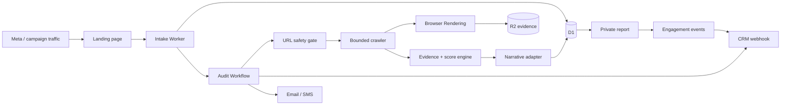
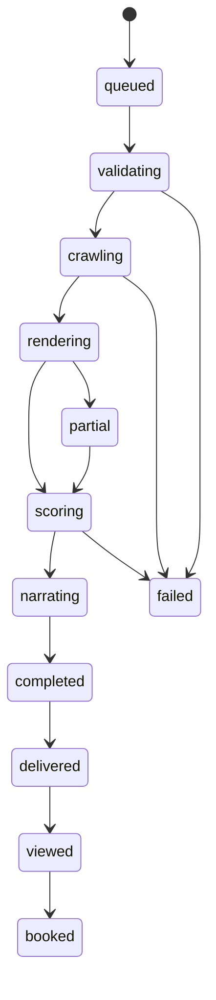

# Architecture and Decision Logic

## 1. System objective

Turn an advertisement click into a traceable, evidence-backed audit and then
into a consultation opportunity. The public experience must remain fast even
when crawling, rendering, model calls, or CRM delivery are slow.

## 2. Target production architecture



### Runtime responsibilities

| Component | Owns | Must not own |
| --- | --- | --- |
| Landing page | Value proposition, lead fields, consent, attribution | Audit execution |
| Intake Worker | Validation, identifiers, persistence, workflow start | Long-running crawl |
| Workflow | Durable state transitions, retries, idempotency | Public presentation |
| Crawler | Public-page retrieval within a fixed budget | Narrative conclusions |
| Score engine | Versioned deterministic scoring | Platform-ranking claims |
| Narrative adapter | Explanation of stored evidence | New facts or unverified claims |
| Report | Evidence, priorities, CTA, engagement events | Contact details in URL |
| CRM adapter | Lead/opportunity synchronization | Source-of-truth audit evidence |

## 3. Current MVP versus target

The repository currently performs a bounded single-homepage audit inside the
intake request. This proves the complete acquisition loop with minimal moving
parts.

The production migration keeps the API contract and report schema stable:

1. Intake writes a `queued` audit instead of `processing`.
2. Intake starts a Workflow and returns `/audit/{token}` immediately.
3. The report route renders queued/processing/completed/failed states.
4. Workflow steps persist evidence before invoking the narrative adapter.
5. CRM and notification delivery become retryable non-blocking steps.

No landing-page or report rewrite is required for that migration.

## 4. Audit state machine



Every transition should append an `audit_events` row. Replayed Workflow steps
must use stable idempotency keys so retries cannot create duplicate leads,
reports, messages, or CRM opportunities.

## 5. Evidence model

Evidence is stored in a normalized document before scoring:

```ts
type EvidenceDocument = {
  auditId: string;
  methodologyVersion: string;
  pages: Array<{
    requestedUrl: string;
    finalUrl: string;
    status: number;
    title: string | null;
    description: string | null;
    headings: string[];
    internalLinks: string[];
    jsonLd: unknown[];
    robots: string[];
    screenshotKeys: { desktop?: string; mobile?: string };
  }>;
  site: {
    robotsTxt?: string;
    sitemapUrls: string[];
    canonicalHost: string;
  };
};
```

Large HTML, screenshots, PDFs, and browser snapshots belong in R2. D1 stores
searchable metadata, scores, status, and R2 object keys.

## 6. Scoring logic

The current `homepage-readiness-v1` score totals 100:

- Technical access: 40
- Answer readiness: 35
- Trust and conversion: 25

Each check contains:

- stable key
- human label
- pass/fail result
- weight
- evidence statement

Changing weights or pass criteria requires a new methodology version. Existing
reports retain the version used when they were generated.

### Observed visibility is separate

Platform visibility experiments must never be mixed silently into readiness.
Each observation needs:

- platform and product surface
- model/version when available
- exact query
- market/location/language
- timestamp
- whether browsing/search was enabled
- business mention and rank
- cited source URLs
- captured response evidence

API output may not represent consumer-product output. Reports must disclose the
surface actually tested.

## 7. Model routing

Models interpret evidence; they do not crawl or score.

Recommended routing:

1. Pure code extracts facts and calculates the score.
2. A cost-efficient structured-output model creates a concise explanation.
3. A stronger model is called only when checks conflict or confidence is low.
4. The model receives only the normalized evidence document.
5. Every generated claim must reference an evidence key.
6. Schema validation rejects unsupported claims.

Provider adapters should implement:

```ts
interface NarrativeProvider {
  generate(input: {
    evidence: EvidenceDocument;
    score: AuditScore;
  }): Promise<{
    summary: string;
    findings: Array<{
      evidenceKeys: string[];
      impact: string;
      recommendation: string;
      title: string;
    }>;
  }>;
}
```

This interface supports an API model today and a local/open-weight pull consumer
later without changing report storage.

## 8. URL and crawl security

The current guard rejects non-HTTP schemes, credentials, localhost, obvious
private/reserved IPv4 addresses, IPv6 literals, and internal-use suffixes. Every
redirect is normalized and checked again. Responses have strict timeout, size,
content-type, and redirect limits.

Before broad production crawling, add a dedicated egress layer that resolves
DNS and rejects private/reserved destinations both before connecting and after
redirects. Protect against:

- DNS rebinding
- alternative IP encodings
- redirect chains into private networks
- oversized or compressed response bombs
- infinite crawls and URL explosions
- authentication/cookie prompts
- form submission and other page side effects

Crawler policy must be explicit about robots rules, user-agent identification,
page budgets, and customer authorization.

## 9. Data and privacy

The report token is 192 bits of randomness and contains no email, mobile,
domain, or lead ID. Treat it as a bearer secret.

Production controls:

- encrypt transport everywhere
- restrict staff access to lead records
- define retention and deletion policies
- separate audit authorization from marketing consent
- log consent timestamps and privacy-notice version
- never send raw contact fields to analytics pixels
- send PII to the configured CRM only
- rotate webhook secrets
- add token revocation and optional email verification for sensitive reports

## 10. CRM contract

The adapter emits a stable event envelope:

```json
{
  "event": "audit_completed",
  "auditId": "uuid",
  "contactName": "Example",
  "email": "owner@example.com",
  "mobile": "+60123456789",
  "websiteUrl": "https://example.com/",
  "score": 63,
  "reportUrl": "/audit/random-token"
}
```

Production delivery should add:

- schema version
- event ID
- timestamp
- absolute report URL
- HMAC signature
- retry schedule
- dead-letter queue
- CRM response reference

## 11. Deployment choices

### Cloudflare-first

Best default for paid traffic. Workers/Sites host intake and reports; D1 stores
structured state; R2 stores evidence; Workflows orchestrate; Browser Rendering
captures dynamic pages.

### Local-only

Useful for development and manual audits. A full local browser and local model
are easy to operate, but uptime, security, backups, and ad-traffic reliability
become the operator's responsibility.

### Hybrid

Cloudflare remains the public control plane. A Queue pull consumer running on a
local workstation or GPU server handles browser-heavy crawling or open-weight
inference and returns normalized evidence. If the consumer is offline, jobs
wait instead of losing the lead.

## 12. Observability

Track:

- submission acceptance rate
- invalid/blocked URL rate
- crawl success and duration
- render and model latency
- score distribution by campaign
- report delivery and view rate
- consultation click and booking rate
- CRM delivery failures
- cost per completed audit
- completed-audit-to-booking conversion

Business success is consultation and revenue conversion—not the number of
reports generated.
